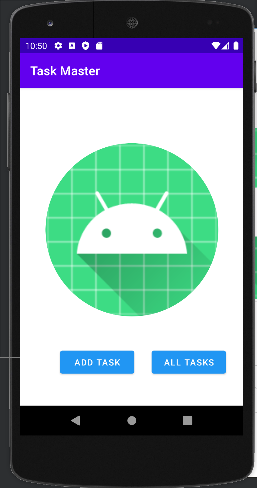

# Beginning Task Master

This is the first iteration of an Android Application called Task master.

### Homepage
The main page is built out with a heading at the top of the page, an image to mock the “my tasks” view, and buttons at the bottom of the page to allow going to the “add tasks” and “all tasks” page.

### Add a Task
On the “Add a Task” page, users type in details about a new task, specifically a title and a body. When users click the “submit” button, it displays  a “submitted!” label on the page.

### All Tasks
The all tasks page should is just image with a back button; it needs no functionality.

